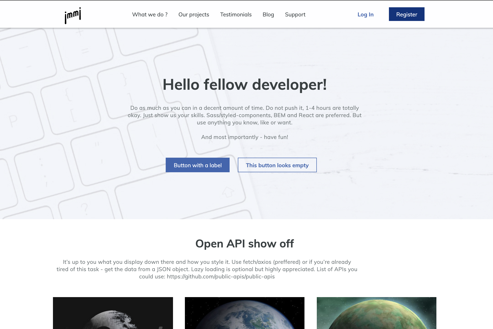

<h2> JMMJ Single page application</h2>



## I developed a Responsive web app clone using React

## [Live Demo](https://jmmj-starwars.web.app/)

## Technologies

- [React](https://reactjs.org/)
- [React-Hooks](https://reactjs.org/docs/hooks-intro.html)
- [React-Icons](https://react-icons.github.io/react-icons/)
- [styled-components](https://styled-components.com/)
- [React-infinite-scroll-component](https://www.npmjs.com/package/react-infinite-scroll-component)
- [Numeral.js](http://numeraljs.com/)
- [Headroom.js](https://wicky.nillia.ms/headroom.js/)
- [Firebase](https://firebase.google.com/)

#### First, Install deps

```bash
$ npm install
#or
$ yarn install
```

#### In the project directory, run the development server::

```bash
$ npm start
#or
$ yarn start
```

Open [http://localhost:3000](http://localhost:3000) with your browser to see the result.
